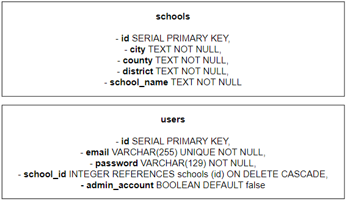
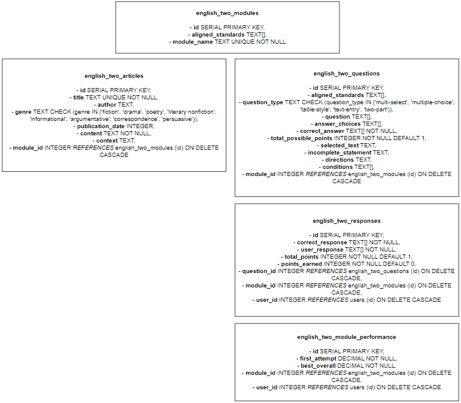
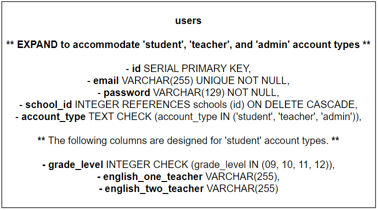
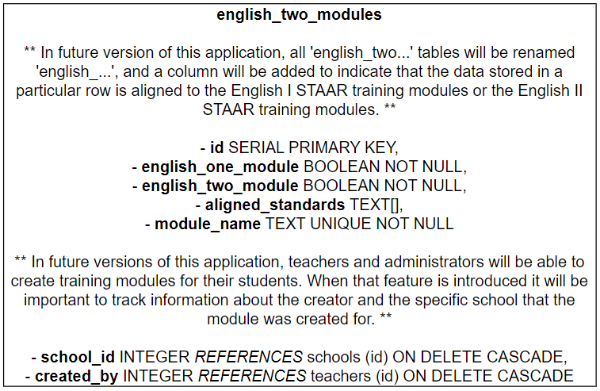

This is the ExpressJS-based backend of a free and open-source STAAR training platform for high school students. The project is currently in beta, but it is designed to be used by all educators in the state of Texas. Noteworthy features include:

#### 1) A Robust, Adaptable PostgreSQL Database

In Version 1.0.0, the database was designed to store information about schools, users, and the English II STAAR Exam:

##### Notes on Future Database Development:

- The 'users' table will be expanded to accomodate different account types: student, teacher, and admin.
  - This will make it relatively easy to grant verified educators special administrative access, as well as the ability to monitor the performance of students in their class / school.
- A 'grade_level' column will be added to make it easier to track the performance of all students by grade level.
  - The value stored in the 'grade_level' column will be an integer: 09, 10, 11, or 12.
- Columns for 'english_one_teacher' (+) 'english_two_teacher' may be added. This will make it easy to break students into cohorts based on their current teacher.
  - These columns will contain their teacher's email address (i.e., 'severus.snape@hogwarts.com').

- All of the 'english_two...' tables will be modified to support data storage for the STAAR English I Exam:

#### 2) Testing w/ Jest

In Version 1.0.0 there are 16 test suites and 45 total tests. The command to run them effectively is [**npm test**] which executes [**jest --runInBand**].

#### 3) Set-up a Local Database for Development && Make Contributions to this Project

1. [Download PostgreSQL](https://www.postgresql.org/download/)

2. [Download Node.js](https://nodejs.org/en/download/)

3. **Fork this repository:** Click the fork button on the top of this page. This will create a copy of this repository in your account.

4. **Clone the forked repository:** Go to your GitHub account, open the forked repository, click on the code button, and click _copy to clipboard_. Then, open a terminal and run this git command: [git clone "insert copied url here"]

5. **Create a branch:** Navigate to the repository directory on your computer (if you're not there already). Create a branch using the [git switch] command. For example: [git switch -c new-branch-name]

6. **Make desired changes.**

7. **Commit changes:** Use the [git commit] command. For example: [git commit -m 'added another module to the db-seed.sql file']

8. **Push changes to GitHub.**

9. **Submit changes for review:** Go to your repository on GitHub, and click the "compare & pull request" button. Give your request a succint, informative title. Provide a brief explanation of the proposed changes, and click the "create pull request" button.
